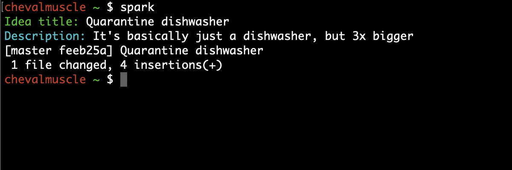

# Spark

A simple cli to input and store your ideas directly with git and without a text editor

Run `spark`, write your idea title and description and your idea will be added a file with your chosen location and commit+push your idea to your git repo. Great when you want to quickly note your next genius idea ✨

## Usage

`spark` to write a new idea

## Installation

Install a prebuilt binary from the [releases page][]

### Build from source

0. [Install go](https://golang.org/doc/install)
1. Clone the repo
2. Run `make deps` to install the required dependencies
3. Run `make run`
